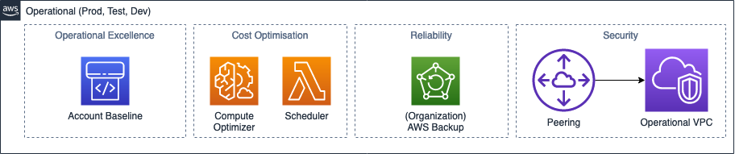
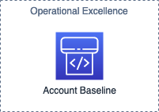
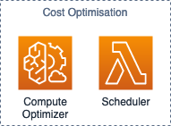
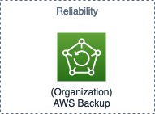
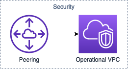

Operational
==========

.. autosummary::
    :toctree: generated

    Bedrock

Account Design
----------------------

Operational Excellence Design
----------------------

Cost Optimisation Design
----------------------

Scheduler has a role in these accounts, actual Lambda and CloudWatch schedule is in the Central account

Reliability Design
----------------------

AWS Backup is set from the Organisation Level, refer to Management-Reliability

Security Design
----------------------

